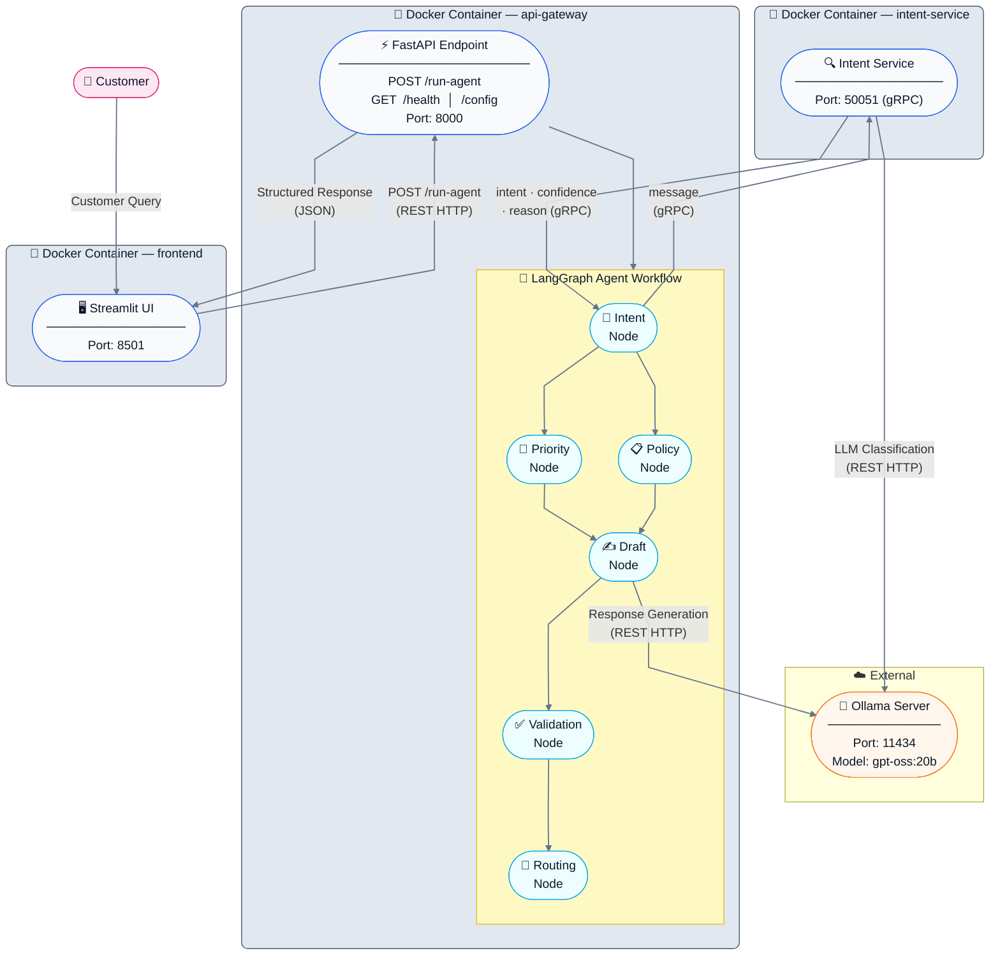

# Banking Service

Banking Service is a microservice-based AI customer support system for banking messages. The project separates the original local agent workflow into independent services that communicate through HTTP and gRPC, then runs them together with Docker Compose.

## Microservice Architecture

The system contains three Dockerized services and one external Ollama server:

- `api-gateway`: FastAPI service and main entry point. It receives HTTP requests from the frontend or external clients, calls the gRPC intent service, runs the remaining workflow nodes, calls Ollama for response generation, and returns a structured result.
- `intent-service`: Independent gRPC microservice for intent detection. It receives a customer message and returns the predicted intent, confidence score, and reason.
- `frontend`: Streamlit web interface for users to send customer messages and inspect the workflow output.
- `ollama`: External model server used by both `api-gateway` and `intent-service`. In this project, Ollama is run outside Docker, for example from a Colab notebook, and its public/local URL is configured through `OLLAMA_BASE_URL`.

## System Architecture



The API Gateway exposes:

- `GET /health`: check whether the API Gateway is running.
- `GET /config`: return the current service configuration.
- `POST /run-agent`: execute the full banking agent workflow.

## Project Structure

```text
banking-service/
  backend/
    app/
      agent/
      clients/
        intent_grpc/
      core/
      data/
      nodes/
    Dockerfile
    requirements.txt
    run.py
  frontend/
    Dockerfile
    interface.py
    requirements.txt
  intent_service/
    app/
    Dockerfile
    Makefile
    intent_service.proto
    intent_service_pb2.py
    intent_service_pb2_grpc.py
    requirements.txt
    server.py
  docker-compose.yml
  README.md
```

## gRPC Code Generation

The gRPC contract is defined in:

```text
intent_service/intent_service.proto
```

The generated Python files are:

```text
intent_service/intent_service_pb2.py
intent_service/intent_service_pb2_grpc.py
```

To regenerate them, run:

```bash
cd intent_service
make
```

Equivalent command:

```bash
python -m grpc_tools.protoc -I. --python_out=. --grpc_python_out=. intent_service.proto
```

After generation, copy the two generated files into the backend gRPC client folder:

```text
backend/app/clients/intent_grpc/intent_service_pb2.py
backend/app/clients/intent_grpc/intent_service_pb2_grpc.py
```

The Docker Compose configuration sets:

```yaml
PYTHONPATH: /src:/src/app/clients/intent_grpc
```

This allows the API Gateway container to import the generated gRPC client modules correctly.

## Ollama Configuration

Ollama is not started as a Docker container in this project. It is expected to run externally, such as from a Colab notebook. Use the Ollama server URL from Colab and replace `OLLAMA_BASE_URL` in `docker-compose.yml` for both services:

```yaml
api-gateway:
  environment:
    OLLAMA_BASE_URL: http://host.docker.internal:11434
    OLLAMA_MODEL: gpt-oss:20b

intent-service:
  environment:
    OLLAMA_BASE_URL: http://host.docker.internal:11434
    INTENT_MODEL_NAME: gpt-oss:20b
```

Both services use the same Ollama endpoint:

- `api-gateway` uses Ollama to generate the final draft response.
- `intent-service` uses Ollama to classify the customer intent.

If the Ollama server is exposed through a Colab tunnel or public URL, replace `http://host.docker.internal:11434` with that URL.

## Build Docker Images

Build all service images:

```bash
docker compose build
```

Build a single service if needed:

```bash
docker compose build api-gateway
docker compose build intent-service
docker compose build frontend
```

## Run With Docker Compose

Start the full system:

```bash
docker compose up
```

Start in detached mode:

```bash
docker compose up -d
```

Stop the system:

```bash
docker compose down
```

Available services:

- Frontend: `http://localhost:8501`
- API Gateway: `http://localhost:8000`
- Intent Service: `localhost:50051`
- External Ollama endpoint: configured by `OLLAMA_BASE_URL`

## Container Roles

| Container | Port | Role |
| --- | --- | --- |
| `api-gateway` | `8000` | FastAPI gateway that orchestrates the full workflow. It receives requests, calls the intent service through gRPC, runs priority, policy, draft, validation, and routing nodes, calls Ollama through HTTP, and returns the final structured response. |
| `intent-service` | `50051` | gRPC microservice for intent recognition. It receives a customer message and returns `intent`, `confidence`, and `reason`. |
| `frontend` | `8501` | Streamlit UI that sends customer messages to `POST /run-agent` and displays the final reply plus workflow details. |
| External Ollama server | `11434` or tunnel URL | Shared LLM server used by both the API Gateway and Intent Service. |

[Video demo](https://drive.google.com/file/d/1enqrnnBxp0oMvVkWBGcz3z7PDz-_rkEG/view?usp=sharing)
[Colab notebook](https://colab.research.google.com/drive/1E51m3gGHLqglWhI-sTSt3l3fizvKuwXl?usp=sharing)
